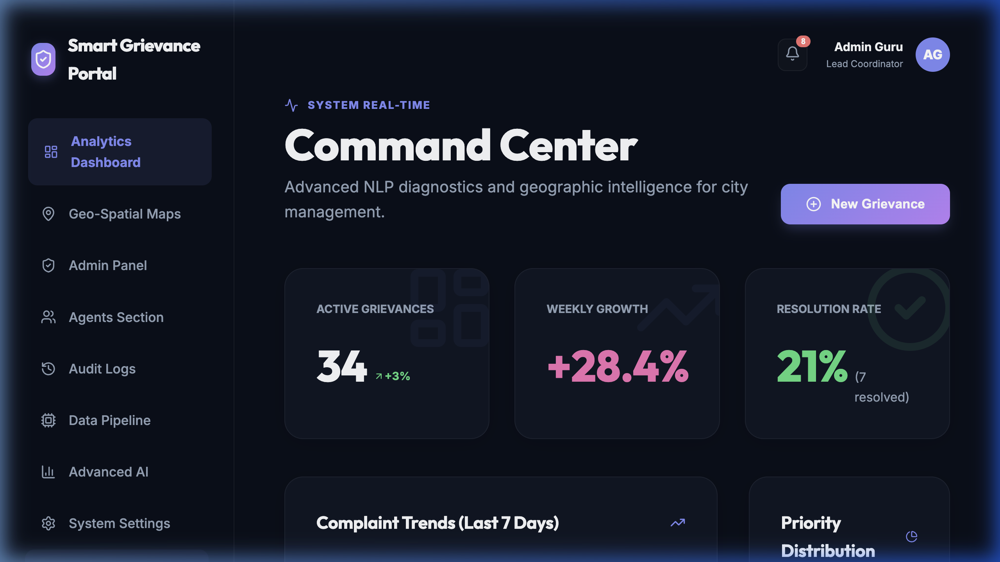
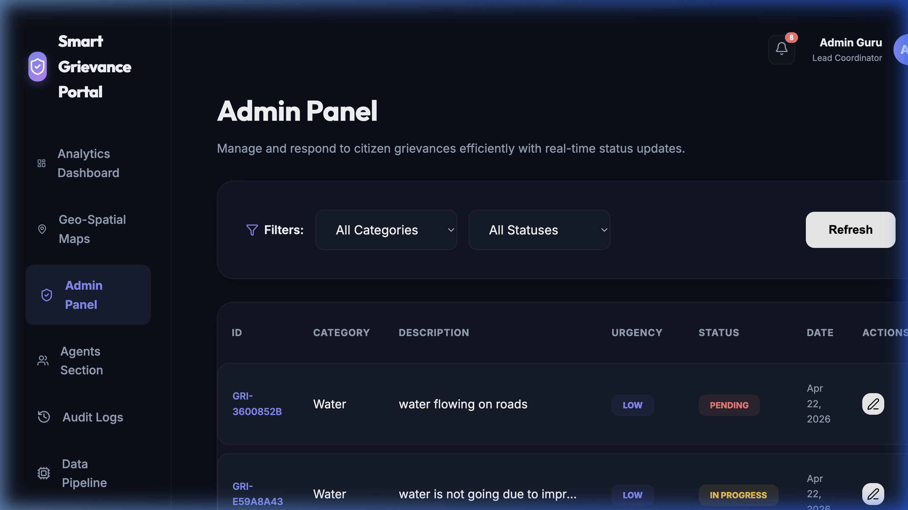
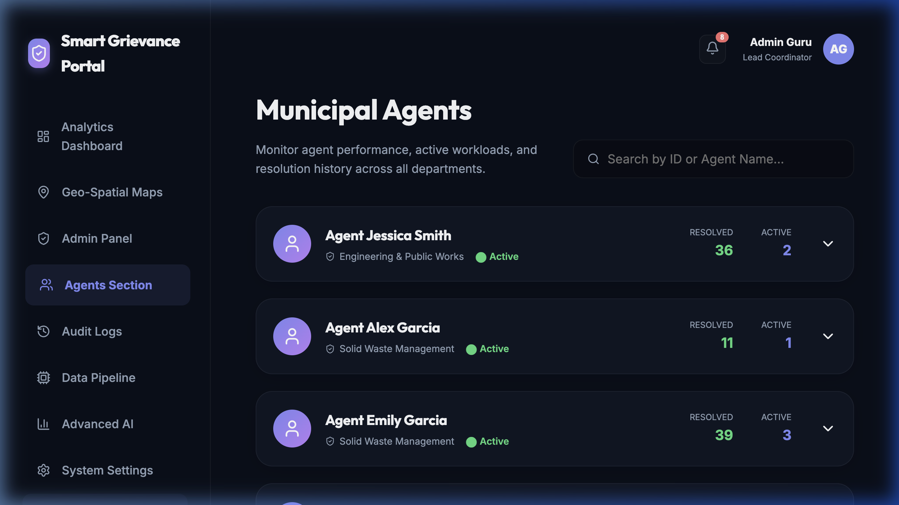
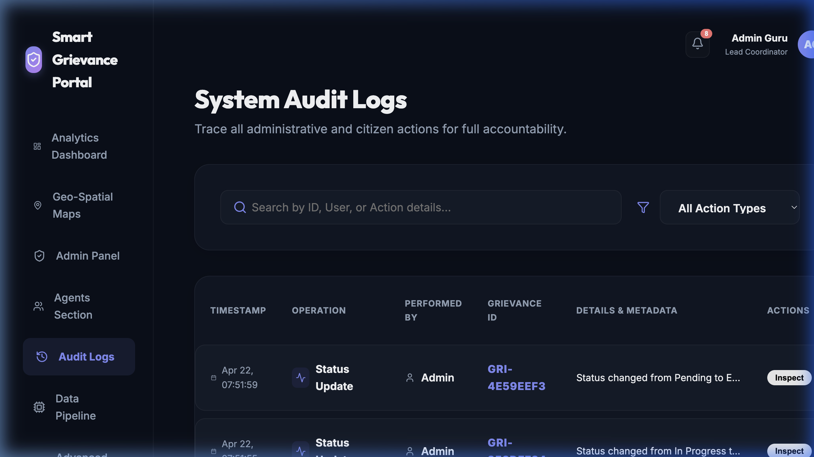
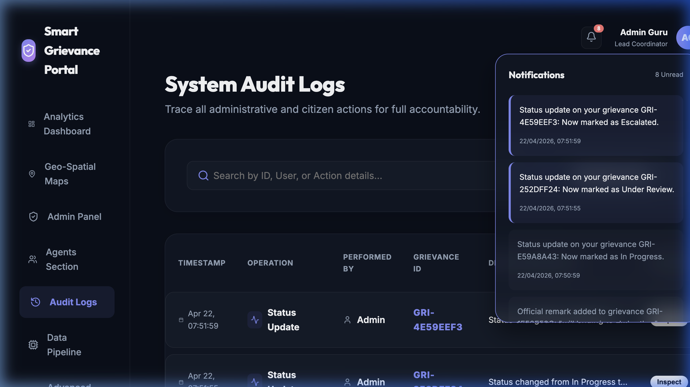

# Municipality Grievance Portal - Smart Support AI

A premium, high-fidelity SaaS platform for municipal grievance management and citizen support. This platform integrates advanced AI classification with a robust FastAPI backend and a modern React frontend to streamline urban problem resolution.

## 🚀 Features

- **Real-time Analytics Dashboard**: Monitor KPIs, grievance growth, and resolution trends.
- **AI-Powered Classification**: Automated ticket categorization and urgency detection using NLP.
- **Dual Portal System**: Unified interface for citizens and municipal administrators.
- **Agent Command Center**: Efficient workload management and performance tracking.
- **Audit Transparency**: Detailed logs for every administrative action.
- **Interactive Geospatial View**: Location-based grievance mapping for field agents.

## 📸 Screenshots

### 1. Analytics Dashboard

### 2. Grievance Management Matrix

### 3. Municipal Agent Roster

### 4. System Audit Logs

### 5. Smart Notifications

## 🛠️ Tech Stack

- **Frontend**: React 19, Vite, Tailwind CSS, Framer Motion, Recharts, Lucide Icons.
- **Backend**: FastAPI, SQLAlchemy, Uvicorn.
- **Database**: SQLite (SQLAlchemy ORM).
- **AI/NLP**: Custom NLP Service for classification and sentiment analysis.

## ⚙️ Installation & Setup

### Backend
1. Navigate to `backend/`
2. Install dependencies: `pip install -r requirements.txt` (or ensure `fastapi`, `uvicorn`, `sqlalchemy` are installed)
3. Run the server: `uvicorn main:app --reload`

### Frontend
1. Navigate to `frontend/`
2. Install dependencies: `npm install`
3. Start the development server: `npm run dev`

---
Built with ❤️ by Antigravity AI.
